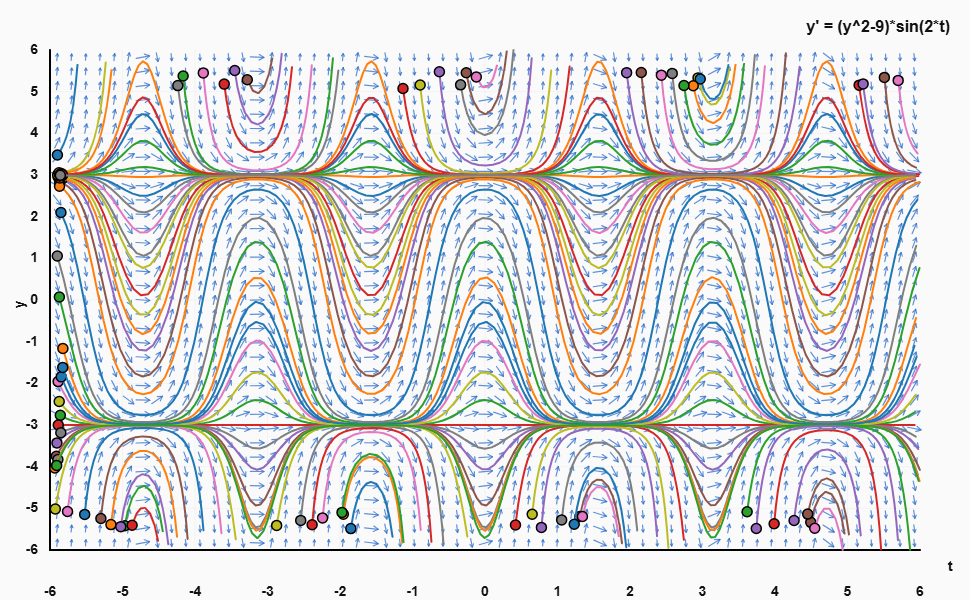

# Quick Performance Fixes - Action Items

## 🔴 CRITICAL - Do Immediately

### 1. Fix the 12MB SVG File (`sk6.svg.svg`)
**Problem**: Largest file on your site (12 MB!) - causes 10-30 second delays

**Action**:
```bash
# Option 1: Check which page uses it
grep -r "sk6.svg" *.html

# Option 2: If not used, delete it
rm sk6.svg.svg

# Option 3: If used, optimize it
# Convert to PNG and compress
```

**Time**: 5 minutes
**Impact**: -12 MB, saves 10-30 seconds per page load

---

### 2. Compress All Images (50-80% size reduction)
**Problem**: PNG files are unoptimized (714 KB, 511 KB, 375 KB)

**Action**:
```bash
# Use TinyPNG.com (free for up to 20 images/month)
# OR use ImageOptim (Mac)
# OR use squoosh.app (web-based)

# Upload these files:
# - direction.png (714 KB → ~140 KB)
# - lotkav.png (511 KB → ~100 KB)
# - fitplot.png (375 KB → ~75 KB)
# - direction-fields.png (287 KB → ~60 KB)
# - newplot.png (227 KB → ~45 KB)
```

**Time**: 15 minutes
**Impact**: -2 to 3 MB total, faster image loading

---

### 3. Re-encode Large Video Files
**Problem**: Videos are 6 MB, 3.3 MB, 2.8 MB - too large

**Action**:
```bash
# Use HandBrake or FFmpeg to re-encode
# Target bitrate: 500-800 kbps for short animations

# Example with FFmpeg:
ffmpeg -i double.webm -b:v 800k -c:v libvpx-vp9 double_optimized.webm
ffmpeg -i cubic.webm -b:v 600k -c:v libvpx-vp9 cubic_optimized.webm
ffmpeg -i mass.webm -b:v 600k -c:v libvpx-vp9 mass_optimized.webm

# Check file sizes - should be 300-800 KB each
```

**Time**: 30 minutes
**Impact**: -10 to 15 MB, much faster video loading

---

## 🟡 HIGH PRIORITY - Do This Week

### 4. Add Lazy Loading to All Images
**Problem**: All images load immediately, slowing initial page render

**Action**:
```bash
# Find all img tags
grep -n '
# After:  

# Can use find/replace in your editor:
# Find:    
  <link rel="stylesheet" href="common.css">
  <!-- Page-specific styles remain inline -->
</head>
```

**Time**: 1-2 hours
**Impact**: -200 to 400 KB across site, enables browser caching

---

### 6. Standardize Navigation
**Problem**: index.html has sidebar nav, other pages have header nav

**Action**:
1. Choose ONE navigation style (recommend header - simpler)
2. Create `nav.html` or use JavaScript to inject
3. Update all pages to use same navigation

**Example shared navigation**:
```html
<!-- navigation.html -->
<header class="bg-white shadow-sm py-8 px-4 sticky top-0 z-10">
  <div class="max-w-6xl mx-auto">
    <h1 class="text-4xl text-center mb-6 font-bold">
      <a href="index.html" class="text-black hover:text-indigo-600">Shelvean Kapita</a>
    </h1>
    <nav>
      <ul class="flex justify-center gap-10">
        <li><a href="index.html" class="nav-link">Home</a></li>
        <li><a href="teaching.html" class="nav-link">Teaching</a></li>
        <li><a href="projects.html" class="nav-link">Diff Eq</a></li>
        <li><a href="linear.html" class="nav-link">Linear Algebra</a></li>
        <li><a href="optim.html" class="nav-link">Linear Programming</a></li>
        <li><a href="numerical.html" class="nav-link">Numerical Methods</a></li>
      </ul>
    </nav>
  </div>
</header>
```

**Time**: 2-3 hours
**Impact**: Consistent UX, easier maintenance, -50 KB duplication

---

## 🟢 MEDIUM PRIORITY - Do This Month

### 7. Replace Plotly.js (saves 3.3 MB per page!)
**Problem**: Plotly.js is 3.5 MB - extremely heavy

**Current**:
```html
<script src="https://cdn.plot.ly/plotly-2.24.1.min.js"></script>
```

**Option 1 - Use Chart.js instead** (200 KB, 17× smaller):
```html
<script src="https://cdn.jsdelivr.net/npm/chart.js@4.4.0/dist/chart.umd.min.js"></script>
```

**Option 2 - Load Plotly from CDN with async**:
```html
<script src="https://cdn.plot.ly/plotly-2.24.1.min.js" defer></script>
```

**Option 3 - Use Plotly.js basic bundle** (1.1 MB instead of 3.5 MB):
```html
<script src="https://cdn.plot.ly/plotly-basic-2.24.1.min.js"></script>
```

**Time**: 4-8 hours (if converting to Chart.js)
**Impact**: -3.3 MB per page with Plotly, 5-10 sec faster load

---

### 8. Minify Inline Scripts
**Problem**: Large inline JavaScript is unminified

**Action**:
```bash
# Use online tools or build process
# For each large HTML file:

# 1. Extract <script> content
# 2. Minify with https://javascript-minifier.com/
# 3. Replace in HTML file

# OR set up a build process with Vite/Parcel
```

**Time**: 2-4 hours
**Impact**: -20 to 30% reduction in HTML file sizes

---

### 9. Convert Images to WebP
**Problem**: PNG format is larger than modern WebP

**Action**:
```bash
# Use cwebp (Google's WebP encoder)
# Install: brew install webp (Mac) or apt-get install webp (Linux)

cwebp -q 85 direction.png -o direction.webp
cwebp -q 85 lotkav.png -o lotkav.webp
# ... repeat for all PNGs

# Update HTML with fallback:
<picture>
  <source srcset="direction.webp" type="image/webp">
  
</picture>
```

**Time**: 1 hour
**Impact**: -25 to 35% image file sizes

---

## 🔵 LOW PRIORITY - Nice to Have

### 10. Add Caching Headers (.htaccess)
**For TAMU deployment** (if Apache server)

**Action**: Create `.htaccess` file:
```apache
# .htaccess
<IfModule mod_expires.c>
  ExpiresActive On

  # HTML - cache for 1 hour
  ExpiresByType text/html "access plus 1 hour"

  # CSS and JS - cache for 1 year
  ExpiresByType text/css "access plus 1 year"
  ExpiresByType application/javascript "access plus 1 year"

  # Images - cache for 1 year
  ExpiresByType image/png "access plus 1 year"
  ExpiresByType image/jpeg "access plus 1 year"
  ExpiresByType image/webp "access plus 1 year"
  ExpiresByType image/svg+xml "access plus 1 year"

  # Videos - cache for 1 year
  ExpiresByType video/webm "access plus 1 year"
</IfModule>

# Enable compression
<IfModule mod_deflate.c>
  AddOutputFilterByType DEFLATE text/html text/plain text/xml text/css text/javascript application/javascript
</IfModule>
```

**Time**: 10 minutes
**Impact**: Faster repeat visits, less bandwidth usage

---

### 11. Use Tailwind Build Instead of CDN
**Problem**: Tailwind CDN includes ALL styles (300+ KB)

**Action**:
```bash
# Install Tailwind CLI
npm install -D tailwindcss

# Create tailwind.config.js
npx tailwindcss init

# Build CSS (only includes used classes)
npx tailwindcss -i input.css -o output.css --minify

# Replace CDN link with:
# <link rel="stylesheet" href="output.css">
```

**Time**: 2-3 hours
**Impact**: -85 to 95% smaller CSS (from 300 KB to 15-30 KB)

---

## Testing Checklist

After each fix, test with:

```bash
# 1. Check file sizes
ls -lh *.{png,webm,svg,html}

# 2. Test in browser
# - Open DevTools → Network tab
# - Hard refresh (Cmd+Shift+R or Ctrl+Shift+R)
# - Check "Transferred" column
# - Check total page weight

# 3. Test with Lighthouse
# - Open DevTools → Lighthouse
# - Run audit for Performance
# - Aim for 90+ score

# 4. Test on slow connection
# - DevTools → Network → Throttling → Slow 3G
# - Check page still loads in < 10 seconds
```

---

## Priority Order

**Week 1** (Critical - 2-3 hours total):
1. ✅ Delete or optimize `sk6.svg.svg` (5 min)
2. ✅ Compress PNG images (15 min)
3. ✅ Add lazy loading to images (15 min)
4. ✅ Re-encode large videos (30 min)

**Week 2** (High Priority - 5-8 hours):
5. ✅ Create shared CSS file (2 hours)
6. ✅ Standardize navigation (3 hours)
7. ✅ Optimize or replace Plotly.js (2 hours)

**Week 3-4** (Medium Priority - 5-10 hours):
8. ✅ Minify inline scripts (3 hours)
9. ✅ Convert to WebP format (1 hour)
10. ✅ Add .htaccess caching (30 min)

**Month 2** (Low Priority):
11. ✅ Set up Tailwind build process
12. ✅ Consider build system (Vite/Parcel)

---

## Expected Results

**Before optimization**:
- Page size: 2-4 MB
- Load time (mobile): 15-60 seconds
- Lighthouse score: 25-65

**After Week 1 fixes**:
- Page size: 500 KB - 1 MB
- Load time (mobile): 5-15 seconds
- Lighthouse score: 60-75

**After all optimizations**:
- Page size: < 500 KB
- Load time (mobile): < 5 seconds
- Lighthouse score: 85-95

---

## Questions?

If you need help with any of these, check:
- Full analysis: `PERFORMANCE_ANALYSIS.md`
- Image compression: TinyPNG.com or Squoosh.app
- Video encoding: HandBrake or FFmpeg documentation
- Tailwind build: tailwindcss.com/docs/installation

**Good luck with the optimizations!** 🚀
